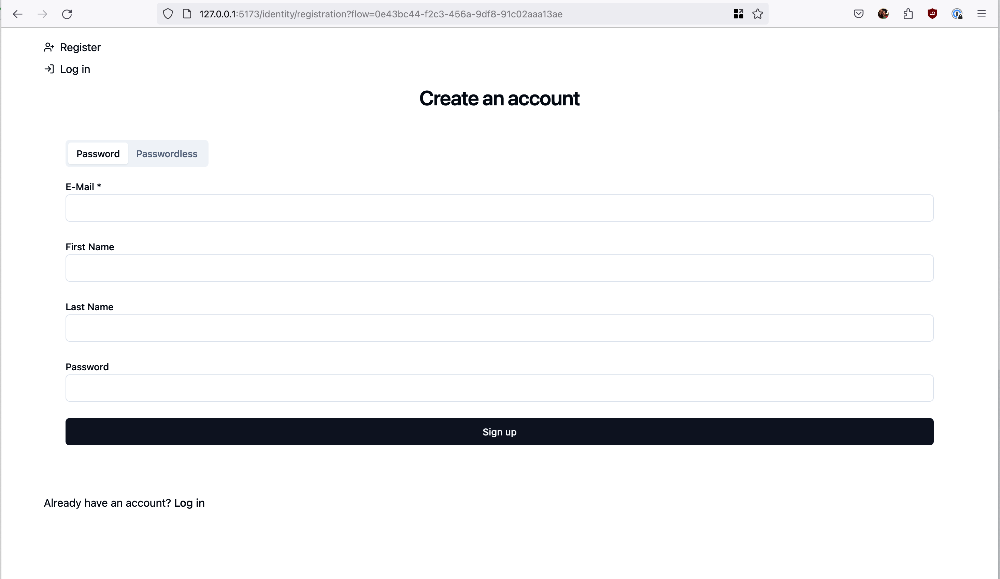

# Ory Kratos SvelteKit Demo

Adapted from [karlis-vagalis/kratos-selfservice](https://github.com/karlis-vagalis/kratos-selfservice).

This is a super fast and responsive self-service UI for open source user management system Ory Kratos built in SvelteKit.

### Features

- Disabled flows from Kratos config are considered (e.g. not showing Sign Up option, if Kratos config has that flow disabled)
- All flows supported: login, logout, signup, recovery, verification, settings
- Tested self-service methods: password (webauthn, code, totp also supported, but untested)
- Error, success and info messages

Not supported (at least yet)
- Languages other than English

### Differences from [karlis-vagalis/kratos-selfservice](https://github.com/karlis-vagalis/kratos-selfservice).

- UI components from [shadcn-svelte](https://shadcn-svelte.com/) where possible, (Tailwind + BitsUI under the hood)
- TypeScript Svelte throughout
- Uses the official Ory Kratos client library for NodeJS, for improved typings
- Isolates each flow's logic in its route rather than colocating it all in one big `+layout.server.ts` + `+layout.svelte`
- Move all Kratos logic to `/identity` subdirectory, better aligned to an app where this might be a small part of a larger app

This is extracted from a personal project so apologies if it includes files / packages that are not actually needed.

I have made no effort to style beyond Shadcn's defaults, so it's not pretty. This is mostly intended as a reference
implementation for any future SvelteKit projects I or others might wish to use Kratos in.

I have not tested the OIDC flows, so they may be broken.

